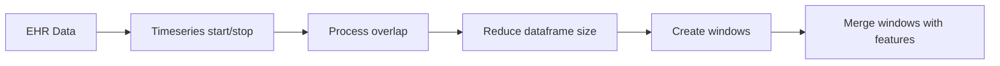

# tadam
_frequently used functions in medical data science_

## Modules
### dataprocessing
`from tadam import data_processing as dp`

#### transformation

```
from tadam.data_processing import (
    transform_single_to_range,
    transform_overlapping_to_discrete_series,
    join_adjoining_records,
    create_windows,
    merge_windows_with_measurements
)
```

#### cleaning


